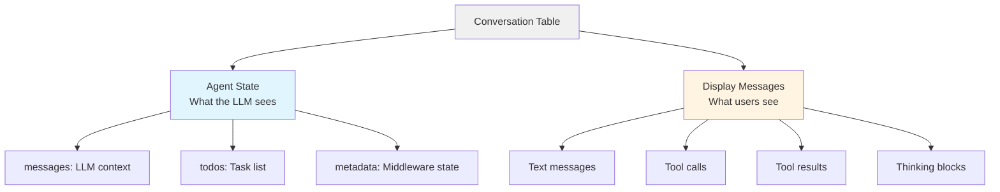
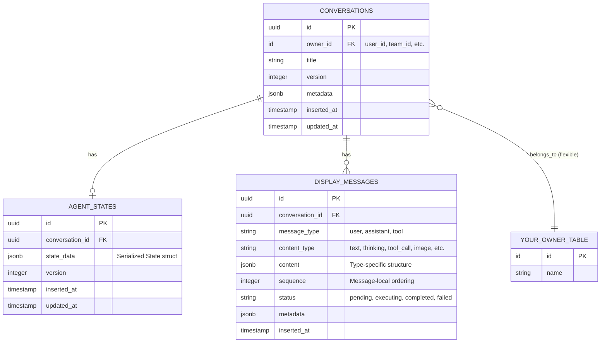

# Conversations Architecture

This document explains how Sagents implements a conversation-centric agent pattern with dual views: one for the agent's internal processing and one for user display.

## The Dual-View Pattern

Every conversation in Sagents has **two separate representations**:



### Agent State (Internal View)

The **AgentState** is what the agent thinks with - the complete serialized state that flows through middleware and LLM calls:

```elixir
# Stored in: agent_states table (JSONB)
%State{
  agent_id: "conversation-123",
  messages: [
    %Message{role: :user, content: "Write a file"},
    %Message{role: :assistant, content: "I'll create that file",
             tool_calls: [%ToolCall{name: "write_file", ...}]},
    %Message{role: :tool, tool_results: [%ToolResult{...}]}
  ],
  todos: [%Todo{content: "Write file", status: :completed}],
  metadata: %{
    "conversation_title" => "File Creation",
    "filesystem_files" => %{"/test.txt" => "content"}
  }
}
```

**Purpose**: Provide the LLM with complete context for decision-making and tool execution.

### Display Messages (External View)

The **DisplayMessage** records are what users see - a UI-friendly representation optimized for rendering:

```elixir
# Stored in: display_messages table (individual rows)
[
  %DisplayMessage{
    message_type: "user",
    content_type: "text",
    content: %{"text" => "Write a file"},
    sequence: 0
  },
  %DisplayMessage{
    message_type: "assistant",
    content_type: "thinking",
    content: %{"text" => "I need to create a file..."},
    sequence: 0
  },
  %DisplayMessage{
    message_type: "assistant",
    content_type: "text",
    content: %{"text" => "I'll create that file"},
    sequence: 1
  },
  %DisplayMessage{
    message_type: "assistant",
    content_type: "tool_call",
    content: %{"call_id" => "123", "name" => "write_file", "arguments" => %{...}},
    sequence: 2,
    status: "pending"
  },
  %DisplayMessage{
    message_type: "tool",
    content_type: "tool_result",
    content: %{"tool_call_id" => "123", "content" => "File created"},
    sequence: 0,
    status: "completed"
  }
]
```

**Purpose**: Enable efficient UI queries, progressive rendering, and rich content types without deserializing agent state.

## Why Two Views?

### The Fundamental Reason: State Optimization vs Display Integrity

The agent's conversation history is **optimized for the LLM's performance**, not user viewing. Middleware can actively rewrite, summarize, or compact the message history to:

- Reduce token usage as conversations grow long
- Remove redundant context that the LLM no longer needs
- Restructure messages for better LLM comprehension
- Optimize for specific agent behaviors

**Users should never see these optimizations.** When an agent summarizes 50 messages into 3 condensed messages to save tokens, users still expect to see all 50 original messages in their chat history.

The dual-view pattern solves this by keeping the agent's working memory (State) completely separate from the user's conversation history (DisplayMessages).

| Aspect | Agent State | Display Messages |
|--------|-------------|------------------|
| **Audience** | LLM | Users |
| **Structure** | Single serialized blob | Individual rows per content |
| **Content** | Complete context + metadata | Formatted for rendering |
| **Querying** | Load once, deserialize | Paginate, filter, search |
| **Updates** | Replace on save | Append-only stream |
| **History** | May be summarized/rewritten | Permanent display record |
| **Mutability** | Middleware can modify | Immutable once saved |

### Key Benefits

1. **Performance**: Load only display messages for UI without deserializing full agent state
2. **Independent evolution**: Agent state can be summarized, compacted, or rewritten by middleware without affecting what users see
3. **Flexibility**: Show thinking blocks, tool execution status, images - things the LLM doesn't need in its context
4. **Streaming**: Progressive UI updates as messages arrive via PubSub
5. **History preservation**: Keep complete display history even when agent state is compressed to reduce token usage

### Example: Summarization Without User Impact

```elixir
# After 100 messages, Summarization middleware triggers

# BEFORE summarization - Agent State has 100 messages
state.messages = [
  %Message{role: :user, content: "What's 2+2?"},
  %Message{role: :assistant, content: "It's 4"},
  %Message{role: :user, content: "And 3+3?"},
  # ... 97 more messages
]

# Display Messages table has 100 rows (unchanged)
display_messages = [
  %DisplayMessage{message_type: "user", content: %{"text" => "What's 2+2?"}},
  %DisplayMessage{message_type: "assistant", content: %{"text" => "It's 4"}},
  # ... all 100 messages preserved
]

# AFTER summarization - Agent State is compacted
state.messages = [
  %Message{role: :system, content: "Summary: User asked math questions, you provided answers: 2+2=4, 3+3=6..."},
  %Message{role: :user, content: "What's 10+10?"},  # Recent messages kept
  %Message{role: :assistant, content: "It's 20"}
]
# Now only 3 messages sent to LLM (saves tokens)

# Display Messages table STILL has 100 rows (unchanged)
# User sees complete conversation history
# LLM only sees summarized context
```

This separation allows the agent to maintain optimal performance (low token usage) while preserving the complete user experience (full conversation history).

## Database Schema



### Schema Integration

The `conversations` table is your **integration point**. It links to your application's owner model via a foreign key that you specify:

```elixir
# Generated with your owner settings
schema "conversations" do
  # Your application's owner relationship
  belongs_to :user, MyApp.Accounts.User, foreign_key: :user_id
  # Or: belongs_to :team, MyApp.Teams.Team, foreign_key: :team_id
  # Or: belongs_to :organization, MyApp.Orgs.Organization

  # Sagents relationships
  has_one :agent_state, AgentState
  has_many :display_messages, DisplayMessage

  field :title, :string
  field :metadata, :map
  timestamps()
end
```

**Flexibility**: You control the owner relationship. The generator creates the schema based on your `--owner-type` and `--owner-field` options, making it work with your existing user, team, or organization structure.

## Data Flow

### Creating a Conversation

```elixir
# 1. User initiates conversation in your app
scope = {:user, current_user.id}
{:ok, conversation} = Conversations.create_conversation(scope, %{title: "New Chat"})
# Creates: conversation row
# Foreign key: conversation.user_id = current_user.id

# 2. Coordinator starts agent
{:ok, session} = Coordinator.start_conversation_session(conversation.id)
# Creates: agent process (AgentServer)
# Links: agent_id = "conversation-#{conversation.id}"
```

### Processing a Message

```elixir
# 1. User sends message
AgentServer.add_message(agent_id, Message.new_user!("Hello"))
# Updates: AgentServer's in-memory State
# Broadcasts: {:agent, {:llm_deltas, ...}} events

# 2. Agent executes, UI receives events
handle_info({:agent, {:llm_deltas, deltas}}, socket) do
  # Update UI in real-time with streaming tokens
end

handle_info({:agent, {:llm_message, message}}, socket) do
  # Message complete
end

# 3. Auto-save persists both views
# Saves: agent_state (State.to_serialized/1 → JSONB)
# Saves: display_messages (via display_message_callback)
```

### Loading a Conversation

```elixir
# For UI rendering
def mount(%{"id" => id}, _session, socket) do
  conversation = Conversations.get_conversation(scope, id)

  # Load display messages for UI (efficient query)
  display_messages = Conversations.load_display_messages(id)
  # => SELECT * FROM display_messages WHERE conversation_id = $1
  #    ORDER BY inserted_at, sequence

  {:ok, assign(socket, conversation: conversation, messages: display_messages)}
end

# For agent restart
def start_conversation_session(conversation_id) do
  # Load agent state for LLM context
  {:ok, state} = Conversations.load_agent_state(conversation_id)
  # => SELECT state_data FROM agent_states WHERE conversation_id = $1
  # => State.from_serialized/2 deserializes JSONB

  # Create agent with restored state
  {:ok, agent} = Factory.create_agent(agent_id: "conversation-#{conversation_id}")
  {:ok, pid} = AgentServer.start_link(agent: agent, initial_state: state)
end
```

## Persistence Callbacks

Sagents provides hooks to save both views automatically:

```elixir
AgentServer.start_link(
  agent: agent,
  initial_state: state,

  # Save agent state periodically
  auto_save: [
    callback: fn _agent_id, state ->
      Conversations.save_agent_state(conversation_id, state)
      # Serializes State → JSONB, upserts to agent_states table
    end,
    interval: 30_000,  # Every 30s if changed
    on_idle: true,     # On execution complete
    on_shutdown: true  # Before process terminates
  ],

  # Save display messages as they arrive
  save_new_message_fn: fn message ->
    # Called for each new message during execution
    display_messages = LangChain.Message.to_displayable_content(message)
    Conversations.append_display_messages(conversation_id, display_messages)
    # Inserts rows into display_messages table
  end
)
```

## Integration with Your Application

### 1. Generate Schemas

```bash
mix sagents.gen.persistence MyApp.Conversations \
  --scope MyApp.Accounts.Scope \
  --owner-type user \
  --owner-field user_id \
  --owner-module MyApp.Accounts.User
```

This creates:
- `conversations` table with `user_id` foreign key
- `agent_states` table linked to conversations
- `display_messages` table linked to conversations
- Context module with scoped queries

### 2. Customize Owner Relationship

The generated schema works with your existing tables:

```elixir
# If you have users
defmodule MyApp.Accounts.User do
  schema "users" do
    has_many :conversations, MyApp.Conversations.Conversation, foreign_key: :user_id
  end
end

# If you have teams
defmodule MyApp.Teams.Team do
  schema "teams" do
    has_many :conversations, MyApp.Conversations.Conversation, foreign_key: :team_id
  end
end
```

### 3. Scope Authorization

The context uses your scope to enforce authorization:

```elixir
def list_conversations(%Scope{type: :user, id: user_id}) do
  Conversation
  |> where([c], c.user_id == ^user_id)
  |> order_by([c], desc: c.updated_at)
  |> Repo.all()
end

def get_conversation(%Scope{type: :user, id: user_id}, conversation_id) do
  Conversation
  |> where([c], c.id == ^conversation_id and c.user_id == ^user_id)
  |> Repo.one()
end
```

This ensures users can only access their own conversations.

## Common Patterns

### Showing Conversation List

```elixir
# Load conversations with metadata (no agent state or messages)
conversations = Conversations.list_conversations(scope, order_by: [desc: :updated_at])

# conversations: [
#   %Conversation{id: "...", title: "Chat 1", updated_at: ~U[...], user_id: 123},
#   %Conversation{id: "...", title: "Chat 2", updated_at: ~U[...], user_id: 123}
# ]
```

### Showing Conversation Thread

```elixir
# Load display messages for rendering
messages = Conversations.load_display_messages(conversation_id)

# messages: [
#   %DisplayMessage{message_type: "user", content: %{"text" => "Hello"}, ...},
#   %DisplayMessage{message_type: "assistant", content: %{"text" => "Hi!"}, ...}
# ]
```

### Resuming Conversation

```elixir
# Load agent state for context
{:ok, state} = Conversations.load_agent_state(conversation_id)

# state: %State{messages: [...], todos: [...], metadata: %{...}}

# Create and start agent with restored state
{:ok, agent} = Factory.create_agent(agent_id: "conversation-#{conversation_id}")
{:ok, pid} = AgentServer.start_link(agent: agent, initial_state: state, ...)
```

### Streaming New Messages

```elixir
# In LiveView
def handle_info({:agent, {:llm_message, message}}, socket) do
  # Convert to display format and save
  display_messages = Message.to_displayable_content(message)
  Conversations.append_display_messages(socket.assigns.conversation_id, display_messages)

  # Update UI
  {:noreply, update(socket, :messages, &(&1 ++ display_messages))}
end
```

## Summary

The conversations architecture separates concerns:

- **Conversations table**: Links everything together and to your owner model
- **Agent State**: Complete LLM context for intelligent responses
- **Display Messages**: Efficient UI rendering with rich content types

This separation enables:
- Fast UI queries without deserializing agent state
- Progressive message streaming with PubSub
- Rich content types (thinking, images, tool status) not needed by LLM
- Flexibility to update agent configuration without migrating stored data

All three schemas are generated to work with your application's owner model, providing flexible integration with users, teams, organizations, or any other ownership structure.
