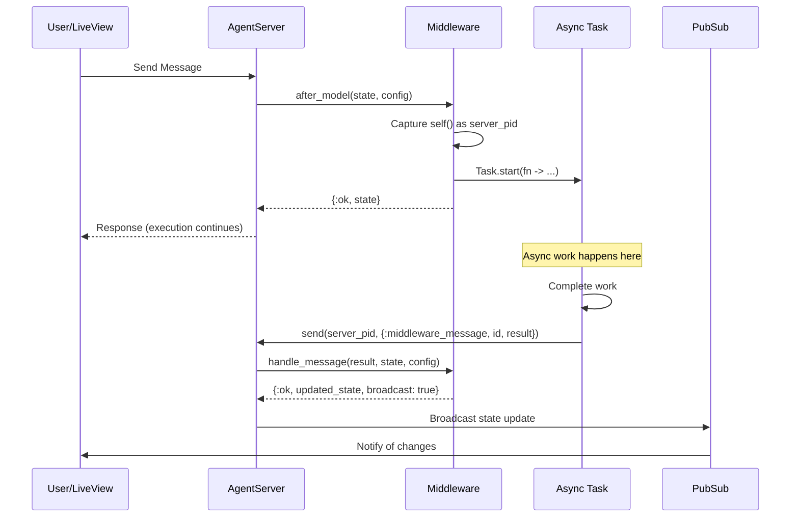
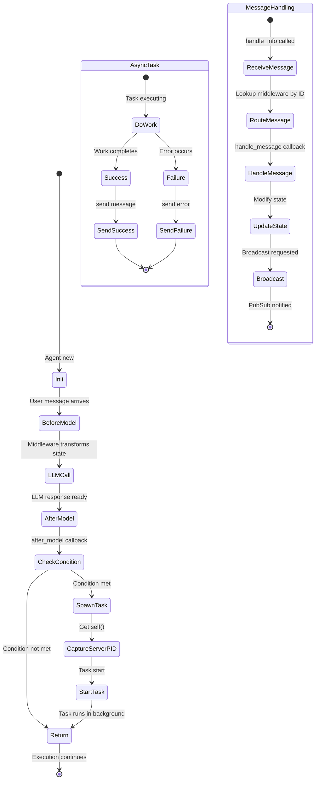

# Middleware Messaging Guide

This guide explains the middleware messaging pattern in LangChain, which enables middleware components to spawn asynchronous processes, communicate with the AgentServer, and receive results back for state updates.

## Table of Contents

- [Overview](#overview)
- [Architecture](#architecture)
- [Core Concepts](#core-concepts)
- [Implementation Guide](#implementation-guide)
- [API Reference](#api-reference)
- [Examples](#examples)
- [Best Practices](#best-practices)
- [Troubleshooting](#troubleshooting)

## Overview

The middleware messaging pattern allows middleware to:

1. **Spawn async tasks** during any lifecycle hook (`before_model`, `after_model`)
2. **Send messages back** to the AgentServer when tasks complete
3. **Receive and handle messages** via the `handle_message/3` callback
4. **Update state** in response to async results
5. **Broadcast updates** to subscribers (LiveViews, external clients)

This pattern is essential for operations that:
- Take significant time (LLM calls, external APIs, file processing)
- Should not block the main agent execution flow
- Need to update state after completion
- Require error handling and retry logic

## Architecture

### High-Level Message Flow



### Middleware Lifecycle with Messaging



## Core Concepts

### 1. Middleware Identification

Each middleware instance has a unique identifier used for message routing:

- **Default ID**: The module name (e.g., `LangChain.Agents.Middleware.ConversationTitle`)
- **Custom ID**: Specified via `:id` option to support multiple instances

```elixir
# Single instance - uses module name as ID
middleware = [
  {ConversationTitle, [
    chat_model: model
  ]}
]

# Multiple instances - custom IDs required
middleware = [
  {ConversationTitle, [
    id: "english_title",
    chat_model: model,
    prompt_template: "Generate English title..."
  ]},
  {ConversationTitle, [
    id: "spanish_title",
    chat_model: model,
    prompt_template: "Generate Spanish title..."
  ]}
]
```

### 2. Capturing the Server PID

Middleware callbacks execute **in the AgentServer process context**, so `self()` returns the AgentServer PID:

```elixir
def after_model(state, config) do
  # self() here IS the AgentServer PID
  server_pid = self()

  Task.start(fn ->
    # This runs in a different process
    result = do_work()
    # Send back to the AgentServer
    send(server_pid, {:middleware_message, config.middleware_id, {:result, result}})
  end)

  {:ok, state}
end
```

### 3. Message Format

Messages sent to the AgentServer follow this pattern:

```elixir
{:middleware_message, middleware_id, message}
```

Where:
- `middleware_id`: Atom (module name) or string (custom ID)
- `message`: Any term (typically a tagged tuple like `{:result, data}`)

### 4. State Updates and Broadcasting

The `handle_message/3` callback can request state broadcasts:

```elixir
def handle_message(message, state, config) do
  updated_state = State.put_metadata(state, "key", value)

  # Request broadcast to subscribers
  {:ok, updated_state, broadcast: true}
end
```

This triggers two PubSub events:
1. `{:middleware_state_update, middleware_id, updated_state}` - Generic update
2. Custom events (e.g., `{:conversation_title_generated, title, agent_id}`) - For backward compatibility

## Implementation Guide

### Step 1: Define the Middleware Module

```elixir
defmodule MyApp.Middleware.CustomMiddleware do
  @behaviour LangChain.Agents.Middleware

  require Logger
  alias LangChain.Agents.State

  @impl true
  def init(opts) do
    # Extract and validate configuration
    api_key = Keyword.get(opts, :api_key)

    unless api_key do
      {:error, "CustomMiddleware requires :api_key option"}
    else
      {:ok, %{api_key: api_key}}
    end
  end
end
```

### Step 2: Implement Lifecycle Hooks

```elixir
@impl true
def after_model(state, config) do
  # Check if async work is needed
  if should_process?(state) do
    spawn_async_task(state, config)
  end

  {:ok, state}
end

defp should_process?(state) do
  # Custom logic to determine if task should run
  State.get_metadata(state, "processed") == nil
end
```

### Step 3: Spawn Async Tasks

```elixir
defp spawn_async_task(state, config) do
  # IMPORTANT: Capture AgentServer PID before spawning
  server_pid = self()

  # Get middleware ID for routing
  middleware_id = Map.get(config, :id, __MODULE__)

  # Extract data needed for processing
  data = extract_data(state)

  # Emit telemetry
  :telemetry.execute(
    [:middleware, :task, :spawned],
    %{count: 1},
    %{middleware: middleware_id, task_type: :custom_processing}
  )

  Task.start(fn ->
    try do
      # Do the actual work
      result = process_data(data, config)

      # Emit success telemetry
      :telemetry.execute(
        [:middleware, :task, :completed],
        %{count: 1},
        %{middleware: middleware_id, task_type: :custom_processing}
      )

      # Send success message back
      send(server_pid, {:middleware_message, middleware_id, {:success, result}})
    rescue
      error ->
        Logger.error("Processing failed: #{inspect(error)}")

        # Emit failure telemetry
        :telemetry.execute(
          [:middleware, :task, :failed],
          %{count: 1},
          %{middleware: middleware_id, task_type: :custom_processing}
        )

        # Send failure message back
        send(server_pid, {:middleware_message, middleware_id, {:error, error}})
    end
  end)
end
```

### Step 4: Handle Messages

```elixir
@impl true
def handle_message({:success, result}, state, _config) do
  Logger.info("Processing completed: #{inspect(result)}")

  # Update state with result
  updated_state =
    state
    |> State.put_metadata("processed", true)
    |> State.put_metadata("result", result)

  # Request broadcast to notify subscribers
  {:ok, updated_state, broadcast: true}
end

def handle_message({:error, error}, state, _config) do
  Logger.error("Processing failed: #{inspect(error)}")

  # Don't update state, just log the error
  {:ok, state}
end
```

### Step 5: Use the Middleware

```elixir
{:ok, agent} = Agent.new(
  agent_id: "my-agent",
  model: chat_model,
  middleware: [
    {MyApp.Middleware.CustomMiddleware, [
      api_key: "secret-key"
    ]}
  ]
)
```

## API Reference

### Middleware Behavior Callbacks

#### `init/1`

```elixir
@callback init(options :: keyword()) ::
  {:ok, config :: map()}
  | {:error, reason :: term()}
```

Initialize the middleware with configuration options. Called once during agent creation.

**Parameters:**
- `options` - Keyword list of configuration options

**Returns:**
- `{:ok, config}` - Configuration map that will be passed to other callbacks
- `{:error, reason}` - Initialization failed

#### `handle_message/3`

```elixir
@callback handle_message(message :: term(), State.t(), config :: map()) ::
  {:ok, State.t()}
  | {:ok, State.t(), opts :: keyword()}
  | {:error, reason :: term()}
```

Handle messages sent from async tasks.

**Parameters:**
- `message` - The message payload (typically a tagged tuple)
- `state` - Current agent state
- `config` - Middleware configuration from `init/1`

**Returns:**
- `{:ok, state}` - Updated state (no broadcast)
- `{:ok, state, broadcast: true}` - Updated state with broadcast request
- `{:error, reason}` - Message handling failed

### Message Sending

Send messages to the AgentServer from async tasks:

```elixir
send(server_pid, {:middleware_message, middleware_id, message})
```

**Parameters:**
- `server_pid` - PID captured via `self()` in middleware callback
- `middleware_id` - Module name or custom ID from config
- `message` - Any term to be handled by `handle_message/3`

### Telemetry Events

The following telemetry events are emitted:

#### `[:middleware, :task, :spawned]`

Emitted when an async task is spawned.

**Measurements:** `%{count: 1}`
**Metadata:** `%{middleware: id, task_type: atom}`

#### `[:middleware, :task, :completed]`

Emitted when a task completes successfully.

**Measurements:** `%{count: 1}`
**Metadata:** `%{middleware: id, task_type: atom}`

#### `[:middleware, :task, :failed]`

Emitted when a task fails.

**Measurements:** `%{count: 1}`
**Metadata:** `%{middleware: id, task_type: atom, error: string}`

#### `[:middleware, :message, :received]`

Emitted when AgentServer receives a middleware message.

**Measurements:** `%{count: 1}`
**Metadata:** `%{middleware: id}`

## Examples

### Example 1: ConversationTitle Middleware

The built-in `ConversationTitle` middleware demonstrates the complete pattern:

```elixir
defmodule LangChain.Agents.Middleware.ConversationTitle do
  @behaviour LangChain.Agents.Middleware

  require Logger
  alias LangChain.Agents.State
  alias LangChain.Chains.TextToTitleChain

  @impl true
  def init(opts) do
    chat_model = Keyword.get(opts, :chat_model)

    unless chat_model do
      {:error, "ConversationTitle middleware requires :chat_model option"}
    else
      {:ok, %{
        chat_model: chat_model,
        fallbacks: Keyword.get(opts, :fallbacks, []),
        examples: Keyword.get(opts, :examples, default_examples())
      }}
    end
  end

  @impl true
  def after_model(state, config) do
    # Only generate title if we don't have one yet
    if State.get_metadata(state, "conversation_title") == nil do
      spawn_title_generation(state, config)
    end

    {:ok, state}
  end

  @impl true
  def handle_message({:title_generated, title}, state, _config) do
    updated_state = State.put_metadata(state, "conversation_title", title)
    {:ok, updated_state, broadcast: true}
  end

  def handle_message({:title_generation_failed, reason}, state, _config) do
    Logger.warning("Title generation failed: #{inspect(reason)}")
    {:ok, state}
  end

  defp spawn_title_generation(state, config) do
    server_pid = self()
    middleware_id = Map.get(config, :id, __MODULE__)
    user_text = extract_user_message(state)

    Task.start(fn ->
      try do
        title = generate_title(user_text, config)
        send(server_pid, {:middleware_message, middleware_id, {:title_generated, title}})
      rescue
        error ->
          send(server_pid, {:middleware_message, middleware_id, {:title_generation_failed, error}})
      end
    end)
  end

  defp generate_title(text, config) do
    TextToTitleChain.new!(%{
      llm: config.chat_model,
      input_text: text,
      examples: config.examples
    })
    |> TextToTitleChain.evaluate(with_fallbacks: config.fallbacks)
  end
end
```

**Usage:**

```elixir
{:ok, agent} = Agent.new(
  agent_id: "chat-agent",
  model: main_model,
  middleware: [
    {LangChain.Agents.Middleware.ConversationTitle, [
      chat_model: ChatAnthropic.new!(%{model: "claude-3-5-haiku-latest"}),
      fallbacks: [backup_model]
    ]}
  ]
)
```

### Example 2: Analytics Middleware

Track conversation analytics asynchronously:

```elixir
defmodule MyApp.Middleware.Analytics do
  @behaviour LangChain.Agents.Middleware

  require Logger
  alias LangChain.Agents.State

  @impl true
  def init(opts) do
    {:ok, %{
      analytics_api: Keyword.get(opts, :analytics_api),
      track_tokens: Keyword.get(opts, :track_tokens, true)
    }}
  end

  @impl true
  def after_model(state, config) do
    # Send analytics in background
    spawn_analytics_task(state, config)
    {:ok, state}
  end

  @impl true
  def handle_message({:analytics_sent, event_id}, state, _config) do
    Logger.debug("Analytics event sent: #{event_id}")
    {:ok, state}
  end

  def handle_message({:analytics_failed, reason}, state, _config) do
    Logger.warning("Analytics failed: #{inspect(reason)}")
    {:ok, state}
  end

  defp spawn_analytics_task(state, config) do
    server_pid = self()
    middleware_id = Map.get(config, :id, __MODULE__)

    # Extract analytics data
    message_count = length(state.messages)
    agent_id = State.get_metadata(state, "agent_id")

    Task.start(fn ->
      try do
        event_id = send_analytics(agent_id, message_count, config)
        send(server_pid, {:middleware_message, middleware_id, {:analytics_sent, event_id}})
      rescue
        error ->
          send(server_pid, {:middleware_message, middleware_id, {:analytics_failed, error}})
      end
    end)
  end

  defp send_analytics(agent_id, message_count, config) do
    # Make API call to analytics service
    config.analytics_api.track_event(%{
      agent_id: agent_id,
      message_count: message_count,
      timestamp: DateTime.utc_now()
    })
  end
end
```

### Example 3: Document Embedding Middleware

Generate embeddings for conversation history:

```elixir
defmodule MyApp.Middleware.Embeddings do
  @behaviour LangChain.Agents.Middleware

  require Logger
  alias LangChain.Agents.State

  @impl true
  def init(opts) do
    {:ok, %{
      embedding_model: Keyword.get(opts, :embedding_model),
      batch_size: Keyword.get(opts, :batch_size, 10)
    }}
  end

  @impl true
  def after_model(state, config) do
    # Check if we should generate embeddings
    message_count = length(state.messages)

    if rem(message_count, config.batch_size) == 0 do
      spawn_embedding_task(state, config)
    end

    {:ok, state}
  end

  @impl true
  def handle_message({:embeddings_generated, embeddings}, state, _config) do
    Logger.info("Generated #{length(embeddings)} embeddings")

    updated_state = State.put_metadata(state, "embeddings", embeddings)
    {:ok, updated_state, broadcast: true}
  end

  def handle_message({:embeddings_failed, reason}, state, _config) do
    Logger.error("Embedding generation failed: #{inspect(reason)}")
    {:ok, state}
  end

  defp spawn_embedding_task(state, config) do
    server_pid = self()
    middleware_id = Map.get(config, :id, __MODULE__)

    # Extract text from messages
    texts = extract_message_texts(state)

    Task.start(fn ->
      try do
        embeddings = generate_embeddings(texts, config)
        send(server_pid, {:middleware_message, middleware_id, {:embeddings_generated, embeddings}})
      rescue
        error ->
          send(server_pid, {:middleware_message, middleware_id, {:embeddings_failed, error}})
      end
    end)
  end

  defp generate_embeddings(texts, config) do
    # Call embedding API
    config.embedding_model.embed(texts)
  end

  defp extract_message_texts(state) do
    Enum.map(state.messages, fn msg ->
      LangChain.Message.ContentPart.parts_to_string(msg.content)
    end)
  end
end
```

## Best Practices

### 1. Always Capture Server PID Early

```elixir
# ✅ GOOD - Capture immediately
def after_model(state, config) do
  server_pid = self()  # Captured in AgentServer context

  Task.start(fn ->
    # Use server_pid here
    send(server_pid, {...})
  end)

  {:ok, state}
end

# ❌ BAD - self() in task is the task's PID
def after_model(state, config) do
  Task.start(fn ->
    server_pid = self()  # Wrong! This is the task's PID
    send(server_pid, {...})
  end)

  {:ok, state}
end
```

### 2. Use Descriptive Message Tags

```elixir
# ✅ GOOD - Clear message intent
send(server_pid, {:middleware_message, id, {:title_generated, title}})
send(server_pid, {:middleware_message, id, {:title_generation_failed, error}})

# ❌ BAD - Ambiguous messages
send(server_pid, {:middleware_message, id, title})
send(server_pid, {:middleware_message, id, {:error, error}})
```

### 3. Include Error Handling

```elixir
# ✅ GOOD - Comprehensive error handling
Task.start(fn ->
  try do
    result = do_work()
    send(server_pid, {:middleware_message, id, {:success, result}})
  rescue
    error ->
      Logger.error("Task failed: #{inspect(error)}")
      send(server_pid, {:middleware_message, id, {:error, error}})
  end
end)

# ❌ BAD - No error handling
Task.start(fn ->
  result = do_work()  # Crash if this fails!
  send(server_pid, {:middleware_message, id, {:success, result}})
end)
```

### 4. Emit Telemetry Events

```elixir
# ✅ GOOD - Track task lifecycle
:telemetry.execute([:middleware, :task, :spawned], %{count: 1}, metadata)
# ... do work ...
:telemetry.execute([:middleware, :task, :completed], %{count: 1}, metadata)

# This enables monitoring, alerting, and debugging
```

### 5. Use Conditional Broadcasting

```elixir
# ✅ GOOD - Only broadcast when needed
def handle_message({:result, data}, state, _config) do
  if significant_change?(data) do
    {:ok, update_state(state, data), broadcast: true}
  else
    {:ok, update_state(state, data)}
  end
end
```

### 6. Handle Task Timeouts

Consider using `Task.Supervisor` for production deployments:

```elixir
defp spawn_with_timeout(server_pid, middleware_id, work_fn) do
  Task.Supervisor.start_child(MyApp.TaskSupervisor, fn ->
    try do
      # Work with timeout
      result = :timer.tc(work_fn)
      send(server_pid, {:middleware_message, middleware_id, {:success, result}})
    catch
      :exit, {:timeout, _} ->
        send(server_pid, {:middleware_message, middleware_id, {:timeout, "Task exceeded timeout"}})
    end
  end)
end
```

### 7. Design for Multiple Instances

If your middleware might be used multiple times, support custom IDs:

```elixir
@impl true
def init(opts) do
  # Accept custom ID
  custom_id = Keyword.get(opts, :id)

  config = %{
    # ... other config ...
  }

  # Store custom ID if provided
  config = if custom_id, do: Map.put(config, :id, custom_id), else: config

  {:ok, config}
end

defp spawn_task(state, config) do
  # Use custom ID if available, otherwise module name
  middleware_id = Map.get(config, :id, __MODULE__)
  # ...
end
```

## Troubleshooting

### Messages Not Being Received

**Problem:** Async task completes but `handle_message/3` is never called.

**Solutions:**
1. Verify you captured `server_pid = self()` **before** spawning the task
2. Check the middleware ID matches between spawn and send
3. Ensure the message format is `{:middleware_message, id, message}`
4. Check logs for any crashes in the AgentServer

### State Updates Not Broadcasting

**Problem:** State updates but subscribers don't receive notifications.

**Solutions:**
1. Return `{:ok, state, broadcast: true}` from `handle_message/3`
2. Verify PubSub is configured on the agent
3. Check subscribers are properly subscribed to the agent's topic
4. Look for broadcast errors in logs

### Tasks Hanging or Not Completing

**Problem:** Tasks seem to hang indefinitely.

**Solutions:**
1. Add timeout to async operations
2. Use `Task.Supervisor` for better task management
3. Add logging to track task progress
4. Check for infinite loops or deadlocks in task code
5. Monitor telemetry events to detect stuck tasks

### Multiple Middleware Instances Conflicting

**Problem:** Multiple instances of the same middleware interfere with each other.

**Solutions:**
1. Use custom IDs via `:id` option
2. Ensure each instance has a unique ID
3. Check message routing logic handles custom IDs
4. Verify state updates don't conflict (use different metadata keys)

### Memory Leaks from Tasks

**Problem:** Memory usage grows over time.

**Solutions:**
1. Ensure all spawned tasks eventually complete or timeout
2. Use `Task.Supervisor` with proper restart strategies
3. Clean up resources in task error handlers
4. Monitor task count with telemetry
5. Avoid capturing large state structures in task closures

## See Also

- [ConversationTitle Middleware Implementation](../lib/agents/middleware/conversation_title.ex)
- [Middleware Behavior Definition](../lib/agents/middleware.ex)
- [AgentServer Implementation](../lib/agents/agent_server.ex)
