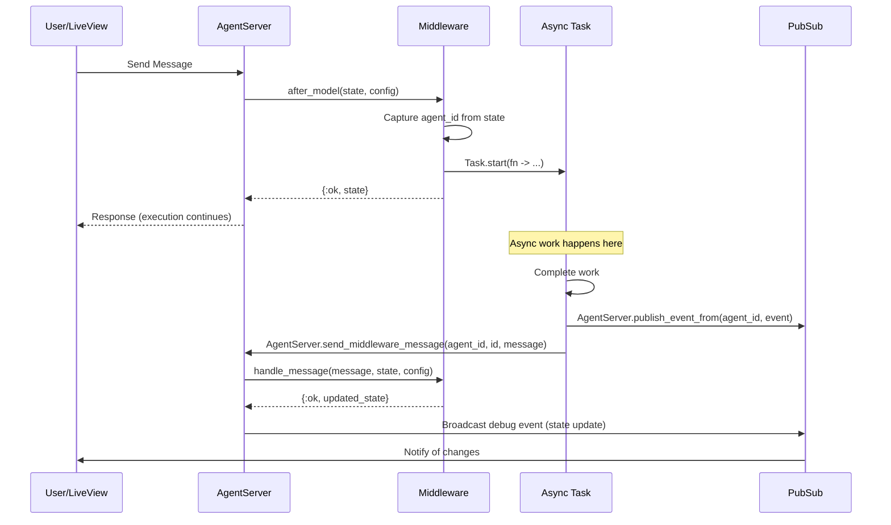

# Middleware Messaging Guide

This guide explains the middleware messaging pattern in Sagents, which enables middleware components to spawn asynchronous processes, communicate with the AgentServer, and receive results back for state updates.

## Table of Contents

- [Overview](#overview)
- [Architecture](#architecture)
- [Core Concepts](#core-concepts)
- [Implementation Guide](#implementation-guide)
- [API Reference](#api-reference)
- [Examples](#examples)
- [Best Practices](#best-practices)
- [Troubleshooting](#troubleshooting)

## Overview

The middleware messaging pattern allows middleware to:

1. **Spawn async tasks** during any lifecycle hook (`before_model`, `after_model`)
2. **Send messages back** to the AgentServer when tasks complete
3. **Receive and handle messages** via the `handle_message/3` callback
4. **Update state** in response to async results
5. **Broadcast updates** to subscribers (LiveViews, external clients)

This pattern is essential for operations that:
- Take significant time (LLM calls, external APIs, file processing)
- Should not block the main agent execution flow
- Need to update state after completion
- Require error handling and retry logic

## Architecture

### High-Level Message Flow



### Middleware Lifecycle with Messaging


## Core Concepts

### 1. Middleware Identification

Each middleware instance has a unique identifier used for message routing:

- **Default ID**: The module name (e.g., `Sagents.Middleware.ConversationTitle`)
- **Custom ID**: Specified via `:id` option to support multiple instances

```elixir
# Single instance - uses module name as ID
middleware = [
  {ConversationTitle, [
    chat_model: model
  ]}
]

# Multiple instances - custom IDs required
middleware = [
  {ConversationTitle, [
    id: "english_title",
    chat_model: model,
    prompt_template: "Generate English title..."
  ]},
  {ConversationTitle, [
    id: "spanish_title",
    chat_model: model,
    prompt_template: "Generate Spanish title..."
  ]}
]
```

### 2. Capturing the Server PID

Middleware callbacks execute **in the AgentServer process context**, so `self()` returns the AgentServer PID:

```elixir
def after_model(state, config) do
  # Capture agent_id before spawning task
  agent_id = state.agent_id
  middleware_id = Map.get(config, :id, __MODULE__)

  Task.start(fn ->
    # This runs in a different process
    result = do_work()
    # Send back to the AgentServer using public API
    AgentServer.send_middleware_message(agent_id, middleware_id, {:result, result})
  end)

  {:ok, state}
end
```

### 3. Message Format

Messages sent to the AgentServer follow this pattern:

```elixir
{:middleware_message, middleware_id, message}
```

Where:
- `middleware_id`: Atom (module name) or string (custom ID)
- `message`: Any term (typically a tagged tuple like `{:result, data}`)

### 4. State Updates and Broadcasting

The `handle_message/3` callback updates state and can trigger broadcasts manually:

```elixir
def handle_message({:result, data}, state, _config) do
  updated_state = State.put_metadata(state, "key", data)

  # The state update is automatically applied by AgentServer
  # To broadcast events to subscribers, use AgentServer.publish_event_from/2
  # (typically done in the async task before sending the message)
  {:ok, updated_state}
end
```

Middleware can broadcast custom events using `AgentServer.publish_event_from/2`:
```elixir
# In async task after work completes
AgentServer.publish_event_from(agent_id, {:custom_event, data})
AgentServer.send_middleware_message(agent_id, middleware_id, {:result, data})
```

When state is updated via `handle_message/3`, a debug event is automatically broadcast:
- `{:agent_state_update, middleware_id, updated_state}` - For debugging/monitoring

## Implementation Guide

### Step 1: Define the Middleware Module

```elixir
defmodule MyApp.Middleware.CustomMiddleware do
  @behaviour Sagents.Middleware

  require Logger
  alias Sagents.State

  @impl true
  def init(opts) do
    # Extract and validate configuration
    api_key = Keyword.get(opts, :api_key)

    unless api_key do
      {:error, "CustomMiddleware requires :api_key option"}
    else
      {:ok, %{api_key: api_key}}
    end
  end
end
```

### Step 2: Implement Lifecycle Hooks

```elixir
@impl true
def after_model(state, config) do
  # Check if async work is needed
  if should_process?(state) do
    spawn_async_task(state, config)
  end

  {:ok, state}
end

defp should_process?(state) do
  # Custom logic to determine if task should run
  State.get_metadata(state, "processed") == nil
end
```

### Step 3: Spawn Async Tasks

```elixir
defp spawn_async_task(state, config) do
  # IMPORTANT: Capture variables from parent context before spawning
  agent_id = state.agent_id

  # Get middleware ID for routing
  middleware_id = Map.get(config, :id, __MODULE__)

  # Extract data needed for processing
  data = extract_data(state)

  # Emit telemetry
  :telemetry.execute(
    [:sagents, :middleware, :task, :spawned],
    %{count: 1},
    %{middleware: middleware_id, task_type: :custom_processing}
  )

  Task.start(fn ->
    try do
      # Do the actual work
      result = process_data(data, config)

      # Emit success telemetry
      :telemetry.execute(
        [:sagents, :middleware, :task, :completed],
        %{count: 1},
        %{middleware: middleware_id, task_type: :custom_processing}
      )

      # Broadcast events to subscribers (if needed)
      AgentServer.publish_event_from(agent_id, {:custom_event, result})

      # Send success message back to AgentServer
      AgentServer.send_middleware_message(agent_id, middleware_id, {:success, result})
    rescue
      error ->
        Logger.error("Processing failed: #{inspect(error)}")

        # Emit failure telemetry
        :telemetry.execute(
          [:sagents, :middleware, :task, :failed],
          %{count: 1},
          %{middleware: middleware_id, task_type: :custom_processing, error: inspect(error)}
        )

        # Send failure message back
        AgentServer.send_middleware_message(agent_id, middleware_id, {:error, error})
    end
  end)
end
```

### Step 4: Handle Messages

```elixir
@impl true
def handle_message({:success, result}, state, _config) do
  Logger.info("Processing completed: #{inspect(result)}")

  # Update state with result
  updated_state =
    state
    |> State.put_metadata("processed", true)
    |> State.put_metadata("result", result)

  # State is automatically updated by AgentServer
  # Events should be broadcast from the async task using AgentServer.publish_event_from/2
  {:ok, updated_state}
end

def handle_message({:error, error}, state, _config) do
  Logger.error("Processing failed: #{inspect(error)}")

  # Don't update state, just log the error
  {:ok, state}
end
```

### Step 5: Use the Middleware

```elixir
{:ok, agent} = Agent.new(
  agent_id: "my-agent",
  model: chat_model,
  middleware: [
    {MyApp.Middleware.CustomMiddleware, [
      api_key: "secret-key"
    ]}
  ]
)
```

## API Reference

### Middleware Behavior Callbacks

#### `init/1`

```elixir
@callback init(options :: keyword()) ::
  {:ok, config :: map()}
  | {:error, reason :: term()}
```

Initialize the middleware with configuration options. Called once during agent creation.

**Parameters:**
- `options` - Keyword list of configuration options

**Returns:**
- `{:ok, config}` - Configuration map that will be passed to other callbacks
- `{:error, reason}` - Initialization failed

#### `handle_message/3`

```elixir
@callback handle_message(message :: term(), State.t(), config :: map()) ::
  {:ok, State.t()}
  | {:error, reason :: term()}
```

Handle messages sent from async tasks.

**Parameters:**
- `message` - The message payload (typically a tagged tuple)
- `state` - Current agent state
- `config` - Middleware configuration from `init/1`

**Returns:**
- `{:ok, state}` - Updated state
- `{:error, reason}` - Message handling failed (error is logged but does not halt agent execution)

**Note:** To broadcast events to subscribers, use `AgentServer.publish_event_from/2` from within the async task before sending the message, rather than attempting to broadcast from `handle_message/3`.

#### `on_server_start/2`

```elixir
@callback on_server_start(State.t(), config :: map()) ::
  {:ok, State.t()}
  | {:error, reason :: term()}
```

Called when the AgentServer starts or restarts.

This allows middleware to perform initialization actions that require the AgentServer to be running, such as broadcasting initial state to subscribers (e.g., TODOs for UI display).

**Parameters:**
- `state` - The current agent state
- `config` - Middleware configuration from `init/1`

**Returns:**
- `{:ok, state}` - Success (state typically unchanged but can be modified)
- `{:error, reason}` - Error (logged but does not halt agent startup)

**Example:**
```elixir
@impl true
def on_server_start(state, _config) do
  # Broadcast initial todos when AgentServer starts
  AgentServer.publish_event_from(state.agent_id, {:todos_updated, state.todos})
  {:ok, state}
end
```

### Message Sending

Send messages to the AgentServer from async tasks using the public API:

```elixir
AgentServer.send_middleware_message(agent_id, middleware_id, message)
```

**Parameters:**
- `agent_id` - The agent ID (captured from `state.agent_id`)
- `middleware_id` - Module name or custom ID from config
- `message` - Any term to be handled by `handle_message/3`

**Note:** The public API `AgentServer.send_middleware_message/3` is strongly preferred over raw `send/2` because it:
- Provides a clearer, more maintainable interface
- Handles the case where the AgentServer may not be running
- Is consistent with other AgentServer operations
- Makes testing easier by providing a clear seam for mocking

### Telemetry Events

The following telemetry events are emitted:

#### `[:sagents, :middleware, :task, :spawned]`

Emitted when an async task is spawned.

**Measurements:** `%{count: 1}`
**Metadata:** `%{middleware: id, task_type: atom}`

#### `[:sagents, :middleware, :task, :completed]`

Emitted when a task completes successfully.

**Measurements:** `%{count: 1}`
**Metadata:** `%{middleware: id, task_type: atom}`

#### `[:sagents, :middleware, :task, :failed]`

Emitted when a task fails.

**Measurements:** `%{count: 1}`
**Metadata:** `%{middleware: id, task_type: atom, error: string}`

#### `[:sagents, :middleware, :message, :received]`

Emitted when AgentServer receives a middleware message.

**Measurements:** `%{count: 1}`
**Metadata:** `%{middleware_id: id, agent_id: string}`

## Examples

### Example 1: ConversationTitle Middleware

The built-in `ConversationTitle` middleware demonstrates the complete pattern:

```elixir
defmodule Sagents.Middleware.ConversationTitle do
  @behaviour Sagents.Middleware

  require Logger
  alias Sagents.{State, AgentServer}
  alias LangChain.Chains.TextToTitleChain

  @impl true
  def init(opts) do
    chat_model = Keyword.get(opts, :chat_model)

    unless chat_model do
      {:error, "ConversationTitle middleware requires :chat_model option"}
    else
      {:ok, %{
        chat_model: chat_model,
        fallbacks: Keyword.get(opts, :fallbacks, []),
        examples: Keyword.get(opts, :examples, default_examples())
      }}
    end
  end

  @impl true
  def before_model(state, config) do
    # Only generate title if we don't have one yet
    if State.get_metadata(state, "conversation_title") == nil do
      spawn_title_generation_task(state, config)
    end

    {:ok, state}
  end

  @impl true
  def handle_message({:title_generated, title}, state, _config) do
    Logger.debug("Received title: #{title}")
    updated_state = State.put_metadata(state, "conversation_title", title)
    {:ok, updated_state}
  end

  def handle_message({:title_generation_failed, reason}, state, _config) do
    Logger.warning("Title generation failed: #{inspect(reason)}")
    {:ok, state}
  end

  defp spawn_title_generation_task(state, config) do
    # Capture agent_id for API calls
    agent_id = state.agent_id
    middleware_id = Map.get(config, :id, __MODULE__)
    user_text = extract_last_user_message_text(state)

    # Emit telemetry
    :telemetry.execute(
      [:sagents, :middleware, :task, :spawned],
      %{count: 1},
      %{middleware: middleware_id, task_type: :title_generation}
    )

    Task.start(fn ->
      try do
        # Generate title
        title = generate_title(user_text, config)

        # Emit telemetry
        :telemetry.execute(
          [:sagents, :middleware, :task, :completed],
          %{count: 1},
          %{middleware: middleware_id, task_type: :title_generation}
        )

        # Broadcast event to subscribers
        AgentServer.publish_event_from(agent_id, {:conversation_title_generated, title, agent_id})

        # Send message to AgentServer for state update
        AgentServer.send_middleware_message(agent_id, middleware_id, {:title_generated, title})
      rescue
        error ->
          Logger.error("Title generation failed: #{inspect(error)}")

          :telemetry.execute(
            [:sagents, :middleware, :task, :failed],
            %{count: 1},
            %{middleware: middleware_id, task_type: :title_generation, error: inspect(error)}
          )

          AgentServer.send_middleware_message(agent_id, middleware_id, {:title_generation_failed, error})
      end
    end)
  end

  defp generate_title(text, config) do
    TextToTitleChain.new!(%{
      llm: config.chat_model,
      input_text: text,
      examples: config.examples
    })
    |> TextToTitleChain.evaluate(with_fallbacks: config.fallbacks)
  end

  defp extract_last_user_message_text(state) do
    # Extract text from the last user message
    state.messages
    |> Enum.reverse()
    |> Enum.find(fn msg -> msg.role == :user end)
    |> case do
      nil -> ""
      message -> LangChain.Message.ContentPart.parts_to_string(message.content)
    end
  end
end
```

**Usage:**

```elixir
{:ok, agent} = Sagents.new(
  model: main_model,
  middleware: [
    {Sagents.Middleware.ConversationTitle, [
      chat_model: ChatAnthropic.new!(%{model: "claude-3-5-haiku-latest"}),
      fallbacks: [backup_model]
    ]}
  ]
)
```

### Example 2: Analytics Middleware

Track conversation analytics asynchronously:

```elixir
defmodule MyApp.Middleware.Analytics do
  @behaviour Sagents.Middleware

  require Logger
  alias Sagents.{State, AgentServer}

  @impl true
  def init(opts) do
    {:ok, %{
      analytics_api: Keyword.get(opts, :analytics_api),
      track_tokens: Keyword.get(opts, :track_tokens, true)
    }}
  end

  @impl true
  def after_model(state, config) do
    # Send analytics in background
    spawn_analytics_task(state, config)
    {:ok, state}
  end

  @impl true
  def handle_message({:analytics_sent, event_id}, state, _config) do
    Logger.debug("Analytics event sent: #{event_id}")
    {:ok, state}
  end

  def handle_message({:analytics_failed, reason}, state, _config) do
    Logger.warning("Analytics failed: #{inspect(reason)}")
    {:ok, state}
  end

  defp spawn_analytics_task(state, config) do
    agent_id = state.agent_id
    middleware_id = Map.get(config, :id, __MODULE__)

    # Extract analytics data
    message_count = length(state.messages)

    Task.start(fn ->
      try do
        event_id = send_analytics(agent_id, message_count, config)
        AgentServer.send_middleware_message(agent_id, middleware_id, {:analytics_sent, event_id})
      rescue
        error ->
          AgentServer.send_middleware_message(agent_id, middleware_id, {:analytics_failed, error})
      end
    end)
  end

  defp send_analytics(agent_id, message_count, config) do
    # Make API call to analytics service
    config.analytics_api.track_event(%{
      agent_id: agent_id,
      message_count: message_count,
      timestamp: DateTime.utc_now()
    })
  end
end
```

### Example 3: Document Embedding Middleware

Generate embeddings for conversation history:

```elixir
defmodule MyApp.Middleware.Embeddings do
  @behaviour Sagents.Middleware

  require Logger
  alias Sagents.{State, AgentServer}

  @impl true
  def init(opts) do
    {:ok, %{
      embedding_model: Keyword.get(opts, :embedding_model),
      batch_size: Keyword.get(opts, :batch_size, 10)
    }}
  end

  @impl true
  def after_model(state, config) do
    # Check if we should generate embeddings
    message_count = length(state.messages)

    if rem(message_count, config.batch_size) == 0 do
      spawn_embedding_task(state, config)
    end

    {:ok, state}
  end

  @impl true
  def handle_message({:embeddings_generated, embeddings}, state, _config) do
    Logger.info("Generated #{length(embeddings)} embeddings")

    updated_state = State.put_metadata(state, "embeddings", embeddings)
    {:ok, updated_state}
  end

  def handle_message({:embeddings_failed, reason}, state, _config) do
    Logger.error("Embedding generation failed: #{inspect(reason)}")
    {:ok, state}
  end

  defp spawn_embedding_task(state, config) do
    agent_id = state.agent_id
    middleware_id = Map.get(config, :id, __MODULE__)

    # Extract text from messages
    texts = extract_message_texts(state)

    Task.start(fn ->
      try do
        embeddings = generate_embeddings(texts, config)
        AgentServer.send_middleware_message(agent_id, middleware_id, {:embeddings_generated, embeddings})
      rescue
        error ->
          AgentServer.send_middleware_message(agent_id, middleware_id, {:embeddings_failed, error})
      end
    end)
  end

  defp generate_embeddings(texts, config) do
    # Call embedding API
    config.embedding_model.embed(texts)
  end

  defp extract_message_texts(state) do
    Enum.map(state.messages, fn msg ->
      LangChain.Message.ContentPart.parts_to_string(msg.content)
    end)
  end
end
```

## Best Practices

### 1. Always Capture agent_id Early

```elixir
# ✅ GOOD - Capture agent_id from state
def after_model(state, config) do
  agent_id = state.agent_id  # Captured before spawning task
  middleware_id = Map.get(config, :id, __MODULE__)

  Task.start(fn ->
    # Use agent_id with public API
    AgentServer.send_middleware_message(agent_id, middleware_id, {:result, data})
  end)

  {:ok, state}
end

# ❌ BAD - Trying to access state inside task
def after_model(state, config) do
  Task.start(fn ->
    agent_id = state.agent_id  # state is not in task closure!
    AgentServer.send_middleware_message(agent_id, ...)
  end)

  {:ok, state}
end
```

### 2. Use Descriptive Message Tags

```elixir
# ✅ GOOD - Clear message intent
AgentServer.send_middleware_message(agent_id, id, {:title_generated, title})
AgentServer.send_middleware_message(agent_id, id, {:title_generation_failed, error})

# ❌ BAD - Ambiguous messages
AgentServer.send_middleware_message(agent_id, id, title)
AgentServer.send_middleware_message(agent_id, id, {:error, error})
```

### 3. Include Error Handling

```elixir
# ✅ GOOD - Comprehensive error handling
Task.start(fn ->
  try do
    result = do_work()
    AgentServer.send_middleware_message(agent_id, id, {:success, result})
  rescue
    error ->
      Logger.error("Task failed: #{inspect(error)}")
      AgentServer.send_middleware_message(agent_id, id, {:error, error})
  end
end)

# ❌ BAD - No error handling
Task.start(fn ->
  result = do_work()  # Crash if this fails!
  AgentServer.send_middleware_message(agent_id, id, {:success, result})
end)
```

### 4. Emit Telemetry Events

```elixir
# ✅ GOOD - Track task lifecycle
:telemetry.execute([:sagents, :middleware, :task, :spawned], %{count: 1}, metadata)
# ... do work ...
:telemetry.execute([:sagents, :middleware, :task, :completed], %{count: 1}, metadata)

# This enables monitoring, alerting, and debugging
```

### 5. Broadcast Events Strategically

```elixir
# ✅ GOOD - Broadcast from async task when event is significant
Task.start(fn ->
  result = do_work()

  # Broadcast to subscribers if this is a significant event
  if significant_change?(result) do
    AgentServer.publish_event_from(agent_id, {:important_update, result})
  end

  # Always send message to update state
  AgentServer.send_middleware_message(agent_id, middleware_id, {:result, result})
end)

# State updates via handle_message/3 automatically trigger debug events
# Custom events for user-facing updates should be published explicitly
```

### 6. Handle Task Timeouts

Consider using `Task.Supervisor` for production deployments:

```elixir
defp spawn_with_timeout(agent_id, middleware_id, work_fn) do
  Task.Supervisor.start_child(MyApp.TaskSupervisor, fn ->
    try do
      # Work with timeout
      result = work_fn.()
      AgentServer.send_middleware_message(agent_id, middleware_id, {:success, result})
    catch
      :exit, {:timeout, _} ->
        AgentServer.send_middleware_message(agent_id, middleware_id, {:timeout, "Task exceeded timeout"})
    end
  end)
end
```

### 7. Design for Multiple Instances

If your middleware might be used multiple times, support custom IDs:

```elixir
@impl true
def init(opts) do
  # Accept custom ID
  custom_id = Keyword.get(opts, :id)

  config = %{
    # ... other config ...
  }

  # Store custom ID if provided
  config = if custom_id, do: Map.put(config, :id, custom_id), else: config

  {:ok, config}
end

defp spawn_task(state, config) do
  agent_id = state.agent_id
  # Use custom ID if available, otherwise module name
  middleware_id = Map.get(config, :id, __MODULE__)

  Task.start(fn ->
    result = do_work()
    AgentServer.send_middleware_message(agent_id, middleware_id, {:result, result})
  end)
end
```

## Troubleshooting

### Messages Not Being Received

**Problem:** Async task completes but `handle_message/3` is never called.

**Solutions:**
1. Verify you captured `agent_id = state.agent_id` **before** spawning the task
2. Check the middleware ID matches between spawn and message send
3. Ensure you're using `AgentServer.send_middleware_message(agent_id, middleware_id, message)`
4. Verify the AgentServer is still running (check with `AgentServer.get_status/1`)
5. Check logs for any crashes in the AgentServer or task

### Events Not Broadcasting

**Problem:** State updates but subscribers don't receive notifications.

**Solutions:**
1. Ensure you're calling `AgentServer.publish_event_from/2` from the async task (not from `handle_message/3`)
2. Verify the AgentServer was started with PubSub configured
3. Check subscribers are properly subscribed using `AgentServer.subscribe/1`
4. Verify `agent_id` is correct when calling `publish_event_from/2`
5. Look for broadcast errors in logs

### Tasks Hanging or Not Completing

**Problem:** Tasks seem to hang indefinitely.

**Solutions:**
1. Add timeout to async operations
2. Use `Task.Supervisor` for better task management
3. Add logging to track task progress
4. Check for infinite loops or deadlocks in task code
5. Monitor telemetry events to detect stuck tasks

### Multiple Middleware Instances Conflicting

**Problem:** Multiple instances of the same middleware interfere with each other.

**Solutions:**
1. Use custom IDs via `:id` option
2. Ensure each instance has a unique ID
3. Check message routing logic handles custom IDs
4. Verify state updates don't conflict (use different metadata keys)

### Memory Leaks from Tasks

**Problem:** Memory usage grows over time.

**Solutions:**
1. Ensure all spawned tasks eventually complete or timeout
2. Use `Task.Supervisor` with proper restart strategies
3. Clean up resources in task error handlers
4. Monitor task count with telemetry
5. Avoid capturing large state structures in task closures

## See Also

- [ConversationTitle Middleware Implementation](../lib/sagents/middleware/conversation_title.ex)
- [TodoList Middleware Implementation](../lib/sagents/middleware/todo_list.ex)
- [Middleware Behavior Definition](../lib/sagents/middleware.ex)
- [MiddlewareEntry Struct](../lib/sagents/middleware_entry.ex)
- [AgentServer Implementation](../lib/sagents/agent_server.ex)
