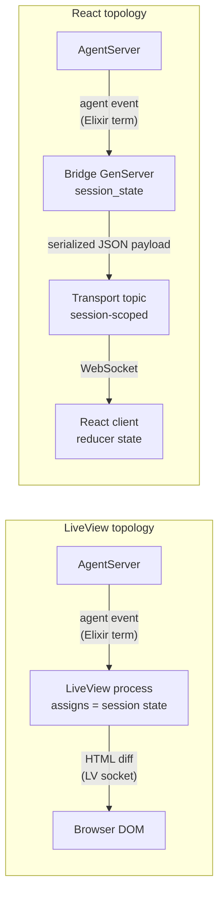
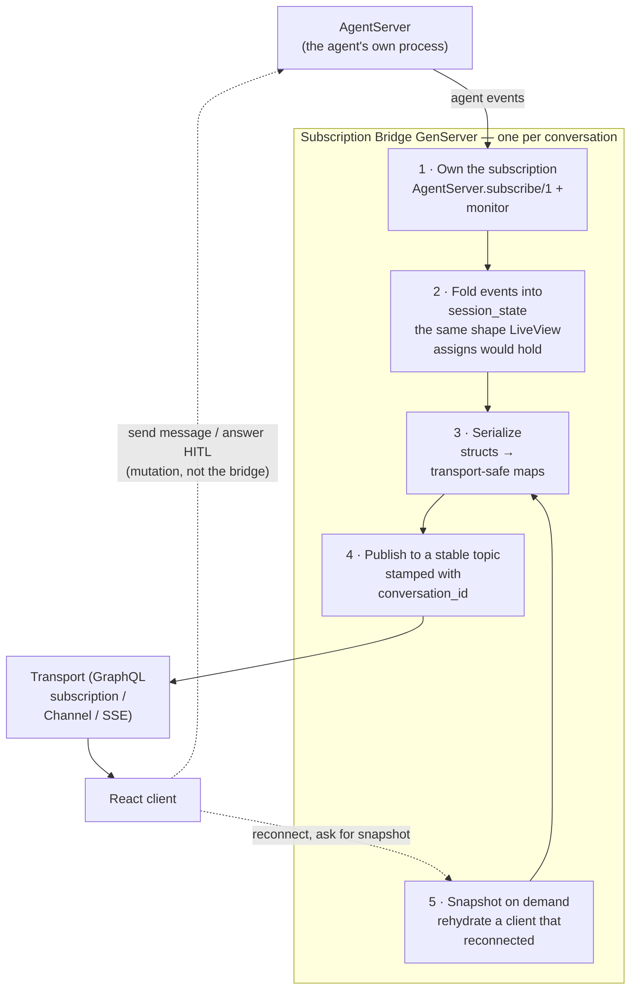
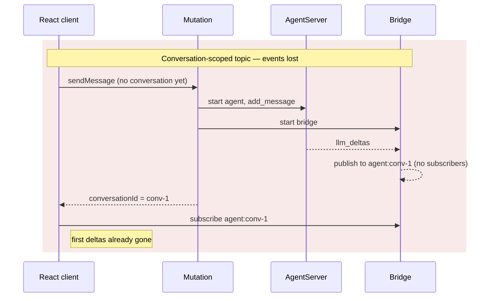
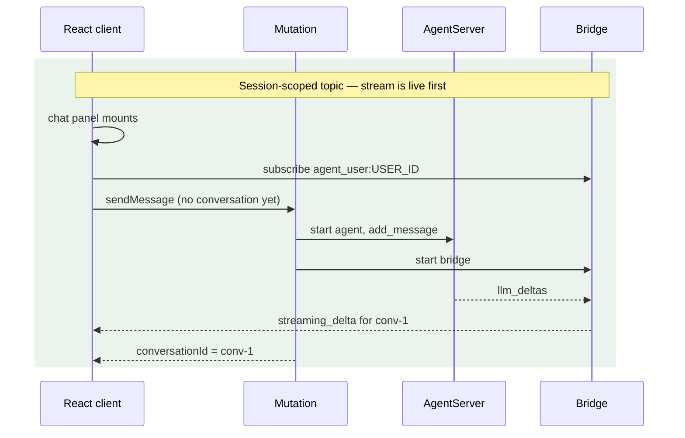
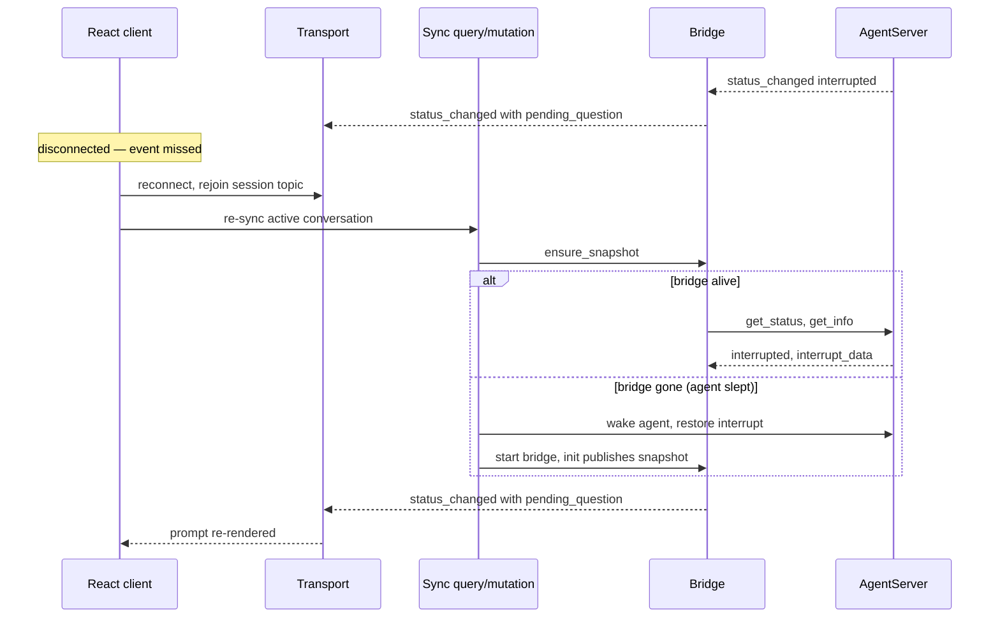
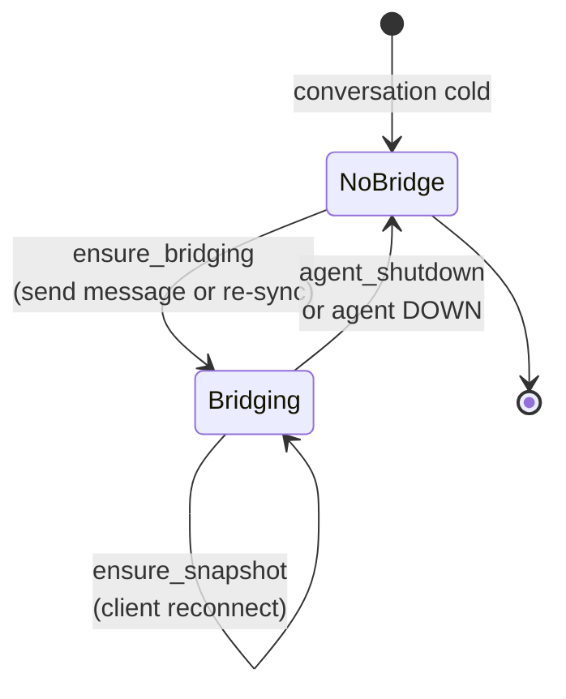

# Using Sagents with a React Front End

Sagents was designed with LiveView in mind. Agent events are plain Elixir
terms delivered by `send/2` from an `AgentServer` to a subscriber **pid**,
and a LiveView is a perfectly good pid: it receives `{:agent, event}`,
folds it into `assigns`, and the framework pushes a diff to the browser.

None of that requires LiveView. It requires *a process*. If your front end
is React, you supply that process yourself — a small, long-lived GenServer
that subscribes on the client's behalf, keeps the same session state a
LiveView would keep in `assigns`, and re-publishes serialized payloads onto
a transport the browser can consume.

This guide describes that pattern — a **subscription bridge** — as a
template you can adapt. The examples use Absinthe GraphQL subscriptions
because that's a common React pairing, but nothing about the bridge is
GraphQL-specific; the last section covers other transports.

Prerequisite reading: [subscriptions_and_presence.md](subscriptions_and_presence.md)
for the event catalog and the raw subscription APIs.

---

## 1. What LiveView was actually doing for you

It helps to be clear on the jobs before replacing them. A Sagents-backed LiveView
does five things:

| # | Job | How LiveView does it |
|---|-----|----------------------|
| 1 | **Hold a subscription** | The LiveView pid is the subscriber; `AgentServer` sends to it directly |
| 2 | **Hold derived UI state** | `assigns` — streaming delta, pending tools, status, todos |
| 3 | **Translate events into view state** | `handle_info/2` clauses merging into `assigns` |
| 4 | **Push to the browser** | Automatic HTML diffing over the LiveView socket |
| 5 | **Own a lifecycle** | Mounts with the page, dies with the tab, `terminate/2` cleans up |

A React client can do #4 itself, and it will hold its own copy of #2 in a
reducer. But #1, #3, and #5 have nowhere to live on the server, and #2 still
needs a server-side copy — because the browser can disconnect and reconnect
while the agent keeps running.

The bridge is that missing process.



The bridge is a *headless LiveView*. Same position in the topology, same
responsibilities, no rendering.

---

## 2. The bridge's five jobs



Note the asymmetry: **events flow out through the bridge, commands flow
directly to the `AgentServer`.** The bridge is a one-way translator. Your
mutations can call `AgentServer.add_message/2` and `AgentServer.resume/2`
themselves, and the resulting events come back around through the bridge
like any others. Don't route commands through the bridge — you'd be adding
a queue in front of a process that already serializes its own calls.

---

## 3. Choosing a topic: session-scoped, not conversation-scoped

This is the decision most likely to bite you, so make it first.

The intuitive design is one transport topic per conversation:
`agent:<conversation_id>`. It has a race in it. The conversation id often
doesn't exist until the user sends their first message, so the client
can't subscribe until *after* the mutation returns — and by then the agent
may already have streamed its first deltas to nobody.



Publish to a **session-scoped topic** instead — keyed by the authenticated
user (or session, or tab), never by the conversation — and stamp every
payload with `conversation_id` so the client can discriminate. The client
opens exactly one subscription when the chat UI mounts, before any
conversation exists.



This mirrors the LiveView model exactly: the LiveView's subscription is
process-scoped, alive from `mount/3`, not conversation-scoped. You get the
same property, plus a free path to rendering multiple concurrent
conversations over one socket.

The client then filters:

```ts
if (event.conversationId && event.conversationId !== activeConversationId) return
```

**Authorize the topic at subscribe time**, from server-trusted session
context — never from a client-supplied argument. The topic string *is* the
authorization boundary.

---

## 4. Session state: the bridge's `assigns`

The bridge holds the state a LiveView would hold. Concretely:

| Key | Type | Why the server must own it |
|-----|------|----------------------------|
| `agent_status` | `:idle \| :running \| :interrupted \| :cancelled \| :error \| :not_running` | The client's ground truth for enabling input, showing spinners |
| `streaming_delta` | `%LangChain.MessageDelta{}` | Accumulated across `:llm_deltas` events; also carries in-flight tool calls |
| `stream_id` | `String.t()` | Correlates deltas with the `streaming_complete` that terminates them, so a late delta from a prior call can be discarded |
| `pending_tools` | `list` | HITL approval requests to render when status is `:interrupted` |
| `pending_question` | `map \| nil` | The current `AskUserQuestion` prompt |
| `remaining_questions` | `list` | Multi-question interrupts answered one at a time |
| `question_responses` | `list` | Answers accumulated so far; the agent resumes once, with all of them |
| `hitl_decisions` | `list` | Same accumulation for tool approvals; required by `AgentUtils.advance_hitl_decisions/3` |
| `interrupt_data` | `map \| nil` | Raw interrupt payload; typed views derive from it |
| `todos` | `list` | Snapshot-replaced on each `:todos_updated` |
| `loading` | `boolean` | Distinguishes "agent thinking" from "agent idle" before the first delta |

Two things make this state non-optional rather than a convenience:

1. **Deltas are incremental.** `{:llm_deltas, deltas}` carries fragments.
   Someone has to `MessageDelta.merge_deltas/2` them. Doing it on the
   server means a reconnecting client can be handed the *merged* state
   instead of having missed half the fragments.
2. **Interrupts are sticky.** An agent sitting at `:interrupted` published
   its prompt once. A client that reloads the page has no way to learn
   about it from the event stream — the event already fired. The bridge
   still holds it, and can re-publish.

### Share the transition logic with LiveView

If your app has both a LiveView and a React front end (common during a
migration), don't write the state transitions twice. Put them in a
**host-agnostic module** whose functions take a plain state map and return
a **changes map**. Each host merges in its own idiom:

```elixir
# LiveView
socket = assign(socket, changes)

# Bridge GenServer
state = %{state | session_state: Map.merge(state.session_state, changes)}
```

Sagents already ships the trickiest piece of this — the tool-call lifecycle:

```elixir
defmodule MyApp.AI.AgentSession do
  @moduledoc "Host-agnostic session-state transitions for agent events."

  alias LangChain.MessageDelta
  alias Sagents.AgentUtils
  alias Sagents.StreamingSession

  def init_session_state do
    %{
      agent_status: :not_running,
      streaming_delta: nil,
      stream_id: nil,
      loading: false,
      todos: [],
      pending_tools: [],
      pending_question: nil,
      remaining_questions: [],
      question_responses: [],
      hitl_decisions: [],
      interrupt_data: nil
    }
  end

  def handle_status_running, do: %{agent_status: :running}

  def handle_status_idle,
    do: %{agent_status: :idle, loading: false, streaming_delta: nil, stream_id: nil}

  def handle_status_cancelled,
    do: %{agent_status: :cancelled, loading: false, streaming_delta: nil, stream_id: nil}

  def handle_status_error(_reason),
    do: %{agent_status: :error, loading: false, streaming_delta: nil, stream_id: nil}

  def handle_status_interrupted(nil), do: %{}

  def handle_status_interrupted(interrupt_data) do
    # AgentUtils turns the raw interrupt into presentable
    # pending_tools / pending_question / remaining_questions.
    Map.merge(
      %{agent_status: :interrupted, loading: false, interrupt_data: interrupt_data},
      AgentUtils.interrupt_session_changes(interrupt_data)
    )
  end

  # Stamp a stream_id when a new LLM call begins; keep it for every delta of
  # that call; clear it on completion. Lets consumers drop stale deltas.
  def handle_llm_deltas(state, deltas) do
    %{
      streaming_delta: MessageDelta.merge_deltas(state[:streaming_delta], deltas),
      stream_id: state[:stream_id] || Ecto.UUID.generate()
    }
  end

  def handle_llm_message_complete,
    do: %{streaming_delta: nil, stream_id: nil, loading: false}

  # Delegate the call_id-keyed tool lifecycle to Sagents so every host gets
  # identical semantics — notably: sibling tool calls in one assistant turn
  # share a single delta, and the delta is only cleared once *every* call in
  # it reaches a terminal status.
  defdelegate handle_tool_call_identified(state, tool_info), to: StreamingSession
  defdelegate handle_tool_execution_update(state, status, tool_info), to: StreamingSession
end
```

`Sagents.StreamingSession` is worth leaning on. Getting "two tools called in
one turn, one finishes first" right by hand is fiddly — an `:interrupted`
tool is *paused*, not terminal, and clearing the delta early makes
in-flight sibling calls vanish from the UI.

---

## 5. Event → payload mapping

The bridge's translation table. Left column is what Sagents delivers; right
column is a suggested wire shape. Every payload also carries
`conversation_id`.

| Agent event | Publish as | Notes |
|---|---|---|
| `{:llm_deltas, deltas}` | `%{type: :streaming_delta, stream_id, streaming_delta}` | Send the **merged** delta, not the fragment. Includes in-flight tool calls |
| `{:llm_message, msg}` | `%{type: :streaming_complete, stream_id, completed: true}` | Content arrives via the persisted message; this just closes the stream |
| `{:status_changed, status, data}` | `%{type: :status_changed, status, interrupt_data, pending_tools, pending_question}` | The single most important event — it carries HITL state |
| `{:tool_call_identified, info}` | `%{type: :tool_identified, call_id, name, display_text, arguments}` | Follow with a `streaming_delta` publish so the delta's tool list updates |
| `{:tool_execution_update, status, info}` | `%{type: :tool_execution_update, call_id, name, status, display_text, result}` | Same — re-publish the delta afterward |
| `{:display_message_saved, msg}` | `%{type: :message_saved, stream_id, message}` | Requires `display_message_persistence`; this is the durable message |
| `{:display_message_updated, msg}` | `%{type: :message_updated, message}` | e.g. a tool row flipping to its final status |
| `{:todos_updated, todos}` | `%{type: :todos, todos}` | Snapshot, not a diff — replace client-side |
| `{:conversation_title_generated, title, id}` | `%{type: :title_generated, title}` | From the `ConversationTitle` middleware |
| `{:agent_shutdown, data}` | *(none — stop)* | Bridge terminates; see lifecycle below |
| `{:llm_token_usage, usage}` | optional | Only if you surface cost/usage |

### Serialization rules

Everything crossing the transport must be JSON-safe. Three rules cover most
of it:

1. **Never send a struct as-is.** `%MessageDelta{}` and
   `%LangChain.Message.ToolCall{}` contain fields your client neither
   understands nor should depend on. Project them explicitly.
2. **Never send a pid, ref, or function.** These appear in raw agent state
   and in some interrupt payloads.
3. **Have a fallback clause.** Interrupt payloads are extensible; a
   catch-all that stringifies the unknown beats a crashing bridge.

```elixir
defp serialize_streaming_delta(nil), do: nil

defp serialize_streaming_delta(%MessageDelta{} = delta) do
  %{
    content: MessageDelta.content_to_string(delta) || "",
    role: "assistant",
    tool_calls: Enum.map(delta.tool_calls || [], &serialize_tool_call/1)
  }
end

defp serialize_tool_call(%ToolCall{} = tc) do
  %{
    call_id: tc.call_id,
    name: tc.name,
    arguments: tc.arguments,
    display_text: tc.display_text,
    status: tc.status,
    execution_status: get_in(tc.metadata, ["execution_status"])
  }
end

defp serialize_interrupt_data(nil), do: nil
defp serialize_interrupt_data(data) when is_map(data), do: data
defp serialize_interrupt_data(data), do: %{raw: inspect(data)}
```

Serializing the delta's `tool_calls` is what lets the client render tool
invocations *inside* the streaming assistant message rather than as
detached rows — the same thing a LiveView gets for free by rendering the
delta struct.

---

## 6. The bridge template

A complete, adaptable GenServer. Registered in
[`Sagents.ProcessRegistry`](../lib/sagents/process_registry.ex) so it's
discoverable and — when Horde is configured — cluster-aware.

```elixir
defmodule MyApp.AI.AgentBridge do
  @moduledoc """
  Bridges Sagents AgentServer events to a React client's transport.

  One bridge per active conversation. Subscribes to the AgentServer
  directly, folds each event into a session state map, and re-publishes a
  serialized payload on a session-scoped topic.
  """
  use GenServer

  alias LangChain.Message.ToolCall
  alias LangChain.MessageDelta
  alias MyApp.AI.AgentSession
  alias Sagents.AgentServer
  alias Sagents.ProcessRegistry

  require Logger

  # =========================================================================
  # Public API
  # =========================================================================

  @doc "Start the bridge for `conversation_id` if one isn't already running."
  def ensure_bridging(conversation_id, agent_id, session) do
    case ProcessRegistry.lookup({:agent_bridge, conversation_id}) do
      [{_pid, _value}] ->
        :ok

      [] ->
        spec = {__MODULE__,
                conversation_id: conversation_id, agent_id: agent_id, session: session}

        case DynamicSupervisor.start_child(MyApp.AI.BridgeSupervisor, spec) do
          {:ok, _pid} -> :ok
          {:error, {:already_started, _pid}} -> :ok
          # init/1 returns :ignore when the agent is gone. Translate it so
          # callers' `with` chains don't have to match a bare atom.
          :ignore -> {:error, :agent_not_running}
          {:error, _reason} = error -> error
        end
    end
  end

  @doc """
  Ensure a client sees current state on its topic.

  No bridge running → start one (its `init/1` publishes a snapshot).
  Bridge already running → ask it to re-publish. Required after a client
  reconnect: the original broadcast went out before this client joined the
  topic.
  """
  def ensure_snapshot(conversation_id, agent_id, session) do
    case ProcessRegistry.lookup({:agent_bridge, conversation_id}) do
      [{pid, _value}] ->
        GenServer.cast(pid, :publish_snapshot)
        :ok

      [] ->
        ensure_bridging(conversation_id, agent_id, session)
    end
  end

  def start_link(opts) do
    conversation_id = Keyword.fetch!(opts, :conversation_id)
    GenServer.start_link(__MODULE__, opts, name: via(conversation_id))
  end

  defp via(conversation_id), do: ProcessRegistry.via_tuple({:agent_bridge, conversation_id})

  # =========================================================================
  # Lifecycle
  # =========================================================================

  @impl true
  def init(opts) do
    conversation_id = Keyword.fetch!(opts, :conversation_id)
    agent_id = Keyword.fetch!(opts, :agent_id)
    session = Keyword.fetch!(opts, :session)

    case AgentServer.subscribe(agent_id) do
      {:ok, _server_pid, _monitor_ref} ->
        state = %{
          conversation_id: conversation_id,
          agent_id: agent_id,
          topic: "agent_user:#{session.user_id}",
          session_state: AgentSession.init_session_state()
        }

        # Defer the snapshot until after init/1 returns, so the process is
        # registered and able to receive replies before we broadcast.
        {:ok, state, {:continue, :publish_initial_snapshot}}

      {:error, :process_not_found} ->
        Logger.warning("AgentBridge #{conversation_id}: agent #{agent_id} not running")
        :ignore
    end
  end

  @impl true
  def handle_continue(:publish_initial_snapshot, state) do
    {:noreply, publish_snapshot(state)}
  end

  @impl true
  def handle_cast(:publish_snapshot, state) do
    {:noreply, publish_snapshot(state)}
  end

  # =========================================================================
  # Event translation
  # =========================================================================

  @impl true
  def handle_info({:agent, {:llm_deltas, deltas}}, state) do
    state = apply_changes(state, AgentSession.handle_llm_deltas(state.session_state, deltas))
    publish_streaming_delta(state)
    {:noreply, state}
  end

  def handle_info({:agent, {:llm_message, _message}}, state) do
    stream_id = state.session_state.stream_id
    state = apply_changes(state, AgentSession.handle_llm_message_complete())

    publish(state, %{type: :streaming_complete, stream_id: stream_id, completed: true})
    {:noreply, state}
  end

  def handle_info({:agent, {:status_changed, status, data}}, state) do
    state = apply_changes(state, status_changes(status, data))
    publish_status(state, status)
    {:noreply, state}
  end

  def handle_info({:agent, {:tool_call_identified, tool_info}}, state) do
    changes = AgentSession.handle_tool_call_identified(state.session_state, tool_info)
    state = apply_changes(state, changes)

    publish(state, %{
      type: :tool_identified,
      call_id: tool_info.call_id,
      name: tool_info[:name],
      display_text: tool_info[:display_text],
      arguments: tool_info[:arguments]
    })

    # The delta now contains this tool call — re-publish so clients that
    # render tools inside the streaming message stay in sync.
    publish_streaming_delta(state)
    {:noreply, state}
  end

  def handle_info({:agent, {:tool_execution_update, status, tool_info}}, state) do
    changes = AgentSession.handle_tool_execution_update(state.session_state, status, tool_info)
    state = apply_changes(state, changes)

    publish(state, %{
      type: :tool_execution_update,
      call_id: tool_info.call_id,
      name: tool_info[:name] || "",
      display_text: tool_info[:display_text],
      status: status,
      result: tool_info[:result]
    })

    publish_streaming_delta(state)
    {:noreply, state}
  end

  def handle_info({:agent, {:display_message_saved, msg}}, state) do
    publish(state, %{
      type: :message_saved,
      stream_id: state.session_state.stream_id,
      message: serialize_display_message(msg)
    })

    {:noreply, state}
  end

  def handle_info({:agent, {:display_message_updated, msg}}, state) do
    publish(state, %{type: :message_updated, message: serialize_display_message(msg)})
    {:noreply, state}
  end

  def handle_info({:agent, {:todos_updated, todos}}, state) do
    state = apply_changes(state, %{todos: todos})
    publish(state, %{type: :todos, todos: Enum.map(todos, &Map.from_struct/1)})
    {:noreply, state}
  end

  # Primary shutdown signal.
  def handle_info({:agent, {:agent_shutdown, _data}}, state) do
    Logger.debug("AgentBridge #{state.conversation_id}: agent shutdown")
    {:stop, :normal, state}
  end

  # Safety net — the agent crashed without broadcasting a shutdown. Our
  # monitor ref (from AgentServer.subscribe/1) points at the agent, so when
  # it dies we go with it.
  def handle_info({:DOWN, _ref, :process, _pid, _reason}, state) do
    Logger.debug("AgentBridge #{state.conversation_id}: agent process down")
    {:stop, :normal, state}
  end

  # Ignore events this bridge doesn't translate.
  def handle_info({:agent, _other}, state), do: {:noreply, state}

  # =========================================================================
  # Snapshot
  # =========================================================================

  # Ask the agent for its live status and publish a single :status_changed,
  # so a freshly attached client sees current state without waiting for the
  # next transition.
  defp publish_snapshot(state) do
    case AgentServer.get_status(state.agent_id) do
      :not_running ->
        state

      status ->
        info = AgentServer.get_info(state.agent_id)
        data = snapshot_data_for_status(status, info)
        state = apply_changes(state, status_changes(status, data))

        publish_status(state, status)
        state
    end
  end

  defp snapshot_data_for_status(:interrupted, info), do: Map.get(info, :interrupt_data)
  defp snapshot_data_for_status(:error, info), do: Map.get(info, :error)
  defp snapshot_data_for_status(_status, _info), do: nil

  # =========================================================================
  # Helpers
  # =========================================================================

  defp apply_changes(state, changes) when is_map(changes) do
    %{state | session_state: Map.merge(state.session_state, changes)}
  end

  defp status_changes(:running, _data), do: AgentSession.handle_status_running()
  defp status_changes(:idle, _data), do: AgentSession.handle_status_idle()
  defp status_changes(:cancelled, _data), do: AgentSession.handle_status_cancelled()
  defp status_changes(:error, reason), do: AgentSession.handle_status_error(reason)
  defp status_changes(:interrupted, data), do: AgentSession.handle_status_interrupted(data)
  defp status_changes(_other, _data), do: %{}

  defp publish_status(state, status) do
    publish(state, %{
      type: :status_changed,
      status: status,
      interrupt_data: serialize_interrupt_data(state.session_state.interrupt_data),
      pending_tools: state.session_state.pending_tools,
      pending_question: state.session_state.pending_question
    })
  end

  defp publish_streaming_delta(state) do
    publish(state, %{
      type: :streaming_delta,
      stream_id: state.session_state.stream_id,
      streaming_delta: serialize_streaming_delta(state.session_state.streaming_delta)
    })
  end

  # Stamp conversation_id on every payload — the client needs it to
  # discriminate events from concurrently running conversations.
  defp publish(state, payload) do
    payload = Map.put(payload, :conversation_id, state.conversation_id)

    Absinthe.Subscription.publish(MyAppWeb.Endpoint, payload,
      subscribe_agent_events: state.topic
    )
  end

  # ... serialize_streaming_delta/1, serialize_tool_call/1,
  #     serialize_interrupt_data/1, serialize_display_message/1
end
```

### Supervision

Start the bridges under a `DynamicSupervisor`. `:transient` is wrong here —
a bridge that stops `:normal` because its agent shut down should stay
stopped, and one that crashes will be restarted with a stale session state
and no subscription. Prefer `restart: :temporary` and let the next
`ensure_bridging/3` create a fresh one:

```elixir
# in your application supervision tree
{DynamicSupervisor, name: MyApp.AI.BridgeSupervisor, strategy: :one_for_one}
```

```elixir
# in the bridge module
use GenServer, restart: :temporary
```

---

## 7. Wiring to GraphQL

Model the payloads as a **union discriminated on `:type`**. The client gets
`__typename` for free, which is exactly the tag a TypeScript switch wants.

```elixir
defmodule MyAppWeb.Schema.AgentTypes do
  use Absinthe.Schema.Notation

  object :agent_streaming_delta_event do
    field :conversation_id, non_null(:id)
    field :stream_id, :id
    field :streaming_delta, :agent_streaming_delta
  end

  object :agent_status_changed_event do
    field :conversation_id, non_null(:id)
    field :status, non_null(:agent_status)
    field :interrupt_data, :json
    field :pending_tools, :json
    field :pending_question, :agent_pending_question
  end

  # ... one object per payload type

  union :agent_conversation_event do
    types([
      :agent_streaming_delta_event,
      :agent_streaming_complete_event,
      :agent_status_changed_event,
      :agent_message_saved_event,
      :agent_message_updated_event,
      :agent_tool_identified_event,
      :agent_tool_execution_update_event,
      :agent_title_generated_event
    ])

    resolve_type fn
      %{type: :streaming_delta}, _ -> :agent_streaming_delta_event
      %{type: :streaming_complete}, _ -> :agent_streaming_complete_event
      %{type: :status_changed}, _ -> :agent_status_changed_event
      %{type: :message_saved}, _ -> :agent_message_saved_event
      %{type: :message_updated}, _ -> :agent_message_updated_event
      %{type: :tool_identified}, _ -> :agent_tool_identified_event
      %{type: :tool_execution_update}, _ -> :agent_tool_execution_update_event
      %{type: :title_generated}, _ -> :agent_title_generated_event
    end
  end

  object :agent_subscriptions do
    @desc """
    One persistent subscription per session, scoped to the authenticated
    user. Open it when the chat UI mounts — before any conversation exists —
    and filter incoming events by `conversationId`.
    """
    field :subscribe_agent_events, :agent_conversation_event do
      config(&subscription_config/2)
    end
  end

  # The topic is derived from server-trusted context, never from arguments.
  defp subscription_config(_args, %{context: %{user: %{id: user_id}}}) do
    {:ok, topic: "agent_user:#{user_id}"}
  end

  defp subscription_config(_args, _resolution), do: {:error, "Not authorized"}
end
```

The send-message mutation is where a turn actually begins. It starts the
agent, guarantees a bridge, then hands the message to the agent:

```elixir
def send_message(_parent, args, %{context: context}) do
  with {:ok, conversation} <- find_or_create_conversation(context, args[:conversation_id]),
       {:ok, agent_id} <- ensure_agent_running(conversation),
       :ok <- AgentBridge.ensure_bridging(conversation.id, agent_id, context.session),
       :ok <- AgentServer.add_message(agent_id, Message.new_user!(args.content)) do
    {:ok, %{conversation_id: conversation.id, status: :accepted}}
  end
end
```

Order matters: **bridge before message.** Reverse them and the first deltas
are published before anything is subscribed to the agent.

Two smaller notes on shaping payloads for a typed client:

- Derive **typed** fields from raw ones with field resolvers. Publish
  `interrupt_data` as `:json` for escape-hatch access, but also expose a
  typed `tool_approval` / `pending_question` object resolved from it, so
  the client isn't hand-parsing a map whose shape can change.
- Keep `stream_id` on both `streaming_delta` and `streaming_complete`. It's
  what lets the client discard a delta that arrives after its stream
  closed — an ordinary occurrence when a tool result triggers a second LLM
  call immediately.

---

## 8. The React side

### One subscription, held for the session's lifetime

The stream is session-scoped, so establish it once and don't tear it down
when the conversation changes. Read the active conversation id and the
event handler through **refs**, so changing either doesn't re-run the
effect and drop the socket:

```ts
export const useAgentSubscription = ({
  conversationId,
  handleAgentEvent,
}: {
  conversationId: string
  handleAgentEvent: (event: AgentConversationEvent) => void
}) => {
  const conversationIdRef = useRef(conversationId)
  useEffect(() => {
    conversationIdRef.current = conversationId
  }, [conversationId])

  const handlerRef = useRef(handleAgentEvent)
  useEffect(() => {
    handlerRef.current = handleAgentEvent
  }, [handleAgentEvent])

  useEffect(() => {
    const subscription = subscribeToAgentEvents({
      onReconnected: handleReconnected,
      onUpdate: (event) => {
        if (!event) return
        // Session-scoped stream: ignore other conversations' events.
        if (
          event.conversationId &&
          event.conversationId !== conversationIdRef.current
        ) {
          return
        }
        handlerRef.current(event)
      },
    })
    return () => subscription.unsubscribe()
  }, [handleReconnected])
}
```

### Dispatch on `__typename`

```ts
const handleAgentEvent = (event: AgentConversationEvent) => {
  switch (event.__typename) {
    case 'AgentStreamingDeltaEvent':
      handleStreamingDelta(event)
      break
    case 'AgentStreamingCompleteEvent':
      handleStreamingComplete(event)
      break
    case 'AgentStatusChangedEvent':
      handleStatusChanged(event)
      break
    case 'AgentMessageSavedEvent':
      handleMessageSaved(event)
      break
    case 'AgentToolIdentifiedEvent':
      handleToolIdentified(event)
      break
    case 'AgentToolExecutionUpdateEvent':
      handleToolExecutionUpdate(event)
      break
  }
}
```

### Client-side state rules

Four rules that keep the UI honest and idempotent:

1. **Streaming text is ephemeral; the saved message is the truth.** Render
   deltas into a provisional bubble keyed by `streamId`, then reconcile
   against the `message_saved` event carrying the same `streamId`. Don't
   accumulate deltas into your permanent message list.
2. **Drop deltas for closed streams.** Keep a set of completed `streamId`s
   and ignore anything arriving for one.
3. **Key everything tool-related by `callId`.** Tool identified → execution
   update → result all share it. Upsert, never append.
4. **Make interrupt rendering idempotent.** The server may re-deliver a
   pending question after a reconnect (see below). Dedupe by
   `toolCallId` so a re-delivery upserts the existing card instead of
   stacking a second one.

Rule 4 is the one people skip, and it's the one that breaks after a
network blip.

---

## 9. Reconnect and rehydration

A LiveView that loses its socket remounts and re-derives everything. A
React client that loses its WebSocket reconnects to a topic and receives
**only future events** — the agent's stream is not replayed. If the agent
went `:interrupted` while the client was away, that prompt is gone forever
unless the server re-publishes it.



Implement it in three parts:

1. **The client detects reconnect** (not initial connect) and fires a
   fire-and-forget re-sync for the active conversation. The recovered state
   arrives on the live stream, not as the query's response.
2. **The server-side sync path calls `ensure_snapshot/3`**, which either
   pokes the running bridge or starts one — and, if the agent itself has
   shut down since, wakes it first. `{:agent_shutdown, data}` carries
   `interrupt_restorable`, which tells you whether a pending interrupt can
   be rebuilt on the next boot; see
   [subscriptions_and_presence.md](subscriptions_and_presence.md).
3. **The bridge re-publishes.** Note that the snapshot path is deliberately
   *less* conditional than the live path: on a live interrupt you publish
   the prompt once, but on a snapshot you re-publish even if you already
   published it before, because you can't know what this client received.
   That's safe precisely because of client rule 4.

If your interrupt prompts are also persisted as display messages, the
snapshot path should re-emit the persisted record rather than inventing a
new one — otherwise a reconnect leaves a duplicate in the conversation
history.

---

## 10. Inbound: messages, HITL, cancel

These bypass the bridge entirely. All `AgentServer` calls serialize on the
agent's own process, so ordering is preserved without any coordination on
your side.

```elixir
# Send a message
AgentServer.add_message(agent_id, Message.new_user!(content))

# Cancel a run
AgentServer.cancel(agent_id)

# Answer a HITL interrupt or an AskUserQuestion
AgentServer.resume(agent_id, resume_data)

# Push client state into a middleware before the next model call
AgentServer.notify_middleware(agent_id, MyApp.Middleware.UserContext, {:context_changed, ctx})
```

**Multi-part interrupts.** A HITL interrupt may hold several tool calls, and
an `AskUserQuestion` may hold several questions. The client answers them
one at a time, but the agent resumes **once**, with all answers. Accumulate
in the session state and only call `resume/2` on the last one.
`Sagents.AgentUtils.advance_hitl_decisions/3` implements this for tool
approvals — it returns `{:more, changes}` while decisions remain and
`{:resume, decisions, changes}` when the set is complete.

The mirror-image pattern for questions:

```elixir
def handle_question_response(state, response) do
  response = Map.put(response, :tool_call_id, state.pending_question.tool_call_id)
  accumulated = state.question_responses ++ [response]

  case state.remaining_questions do
    [] ->
      resume_data = if length(accumulated) == 1, do: hd(accumulated), else: accumulated

      {:resume, resume_data,
       %{pending_question: nil, remaining_questions: [], question_responses: [],
         interrupt_data: nil}}

    [next | rest] ->
      {:more,
       %{pending_question: next, remaining_questions: rest, question_responses: accumulated}}
  end
end
```

After a successful `resume/2`, merge `%{agent_status: :running, loading: true}`
so the UI flips immediately rather than waiting for the status event.

**One caveat on client-supplied context.** Anything the browser sends —
current page, selected record, form contents — is untrusted input. It is
fine to feed into a prompt, but any *identifier* in it must be re-resolved
server-side against the caller's authorization scope before a tool acts on
it. The trust boundary is the resolver, not the middleware.

---

## 11. Presence and lifecycle

Sagents can shut an agent down when nobody is watching (see
[lifecycle.md](lifecycle.md) and the viewer-presence section of
[subscriptions_and_presence.md](subscriptions_and_presence.md)). With
LiveView, the LiveView is the viewer. With React, **the bridge is the
viewer** — it is the only server-side process that exists for as long as
the client is interested.

Track it on the conversation's viewer topic at `init/1`, untrack in
`terminate/2`:

```elixir
@viewer_prefix "bridge:"

# in init/1
Sagents.Presence.track(
  MyApp.Presence,
  "conversation:#{conversation_id}",
  @viewer_prefix <> conversation_id,
  %{type: :subscription_bridge}
)

@impl true
def terminate(_reason, state) do
  Sagents.Presence.untrack(
    MyApp.Presence,
    "conversation:#{state.conversation_id}",
    @viewer_prefix <> state.conversation_id
  )

  :ok
end
```

The resulting lifecycle:



The bridge deliberately has **no independent lifetime**. It starts because
an agent is running and a client cares; it dies when the agent does. It
should never be the reason an agent stays alive, and it should never
outlive one — a bridge holding a stale `agent_id` will silently publish
nothing while looking perfectly healthy.

If you want the agent to sleep when the browser tab closes rather than when
the bridge stops, track a second viewer keyed by the client session and
untrack it on socket disconnect. That's a genuine choice: bridge-as-viewer
keeps agents warm across brief reloads; session-as-viewer reclaims
resources faster.

---

## 12. Checklist

Before shipping a bridge:

- [ ] Topic is **session-scoped**, authorized from server-trusted context,
      and every payload carries `conversation_id`.
- [ ] Client subscribes when the chat UI mounts, **before** the first
      message mutation.
- [ ] Mutation order is: ensure agent → ensure bridge → add message.
- [ ] `init/1` returns `:ignore` when the agent isn't running, and callers
      translate that into an error.
- [ ] Initial snapshot is published from `handle_continue`, not `init/1`.
- [ ] Both `{:agent_shutdown, _}` **and** `{:DOWN, ...}` stop the bridge.
- [ ] A catch-all `handle_info({:agent, _other}, state)` clause exists — new
      Sagents events must not crash the bridge.
- [ ] No struct, pid, ref, or function reaches the serializer's output.
- [ ] `stream_id` is present on delta and complete events; the client drops
      deltas for closed streams.
- [ ] Reconnect triggers a re-sync that re-publishes the current snapshot.
- [ ] Interrupt cards dedupe by `tool_call_id` on the client.
- [ ] Multi-question / multi-tool interrupts resume exactly once.
- [ ] Bridge is `restart: :temporary` under a `DynamicSupervisor`.

## 13. Other transports

Nothing above depends on GraphQL. Only `publish/2` and the payload schema
change:

**Phoenix Channels.** Replace `Absinthe.Subscription.publish/3` with
`MyAppWeb.Endpoint.broadcast(topic, event_name, payload)` and use the event
name where the union's `:type` was. Authorize in `join/3`. Channels give
you a natural `handle_in/3` for the inbound commands too, so a channel
implementation can host both directions in one module — though the
commands should still go straight to `AgentServer`.

**Server-Sent Events.** Keep the bridge exactly as written and have the SSE
controller subscribe to a `Phoenix.PubSub` topic the bridge publishes to.
Since SSE is one-way, commands go over ordinary HTTP endpoints. Note that
SSE has no reconnect handshake you can hook cleanly — you'll want the
client to re-issue the sync request on `EventSource` reopen.

**Plain WebSocket / `Phoenix.Socket.Transport`.** Same shape; you own the
serialization format. This is the most work and the least benefit unless
you already have a socket protocol.

In all cases the bridge stays the same process doing the same five jobs.
The transport is the last ten lines.

---

## Related documents

- [subscriptions_and_presence.md](subscriptions_and_presence.md) — event
  catalog, `Sagents.Subscriber`, presence mechanics
- [lifecycle.md](lifecycle.md) — agent startup, inactivity, shutdown
- [conversations_architecture.md](conversations_architecture.md) — display
  messages and persistence
- [clustering.md](clustering.md) — `ProcessRegistry` with Horde, and what
  changes for a bridge in a multi-node deployment
